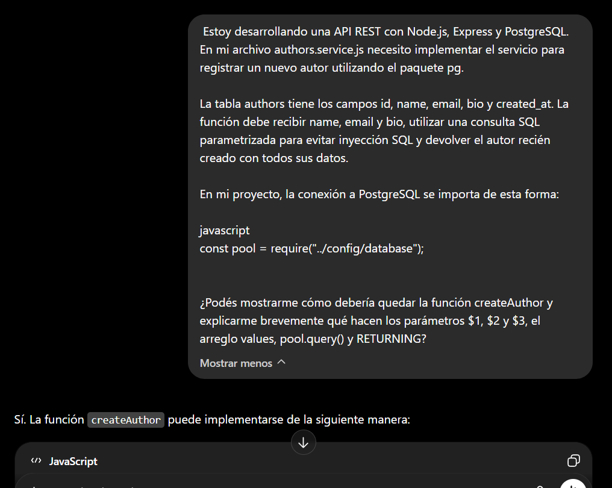
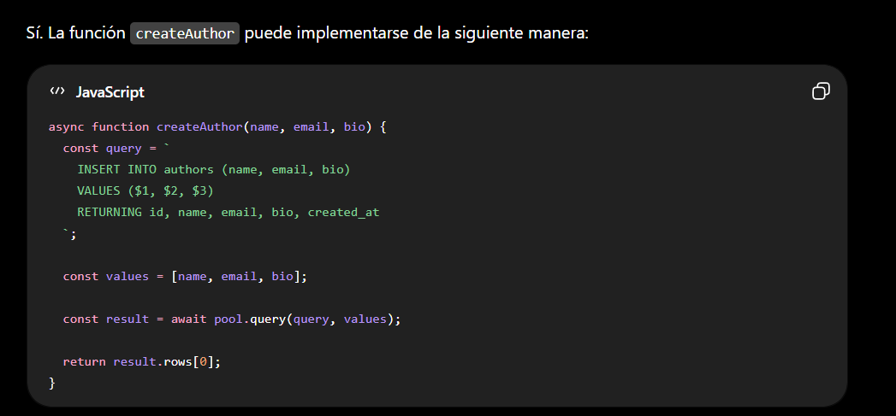
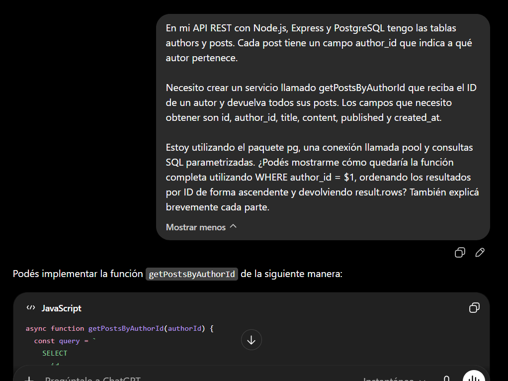
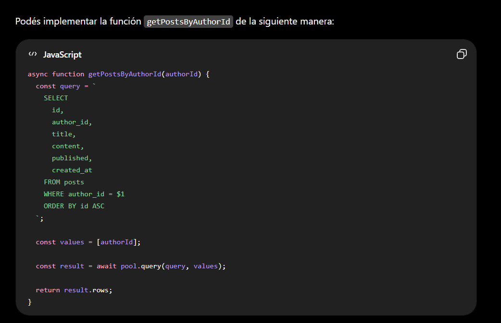

# MiniBlog API

## Descripción

MiniBlog API es una API REST desarrollada con **Node.js**, **Express** y **PostgreSQL** que permite gestionar autores y publicaciones.

El proyecto fue realizado como Proyecto Integrador y permite realizar operaciones CRUD sobre las entidades **authors** y **posts**, utilizando consultas SQL parametrizadas para prevenir ataques de SQL Injection.

Además, incluye pruebas unitarias con **Jest** y **Supertest**, documentación mediante **OpenAPI** y despliegue en **Railway**.

---

## Tecnologías utilizadas

- Node.js
- Express
- PostgreSQL
- pg
- Jest
- Supertest
- OpenAPI
- Railway
- Git
- GitHub

---

## Estructura del proyecto

```text
api-miniblog/
│
├── database/
│   └── setup.sql
│
├── docs/
│   ├── openapi.yaml
│   └── images/
│       ├── consulta1-prompt.png
│       ├── consulta1-respuesta.png
│       ├── consulta2-prompt.png
│       └── consulta2-respuesta.png
│
├── src/
│   ├── config/
│   ├── controllers/
│   ├── routes/
│   ├── services/
│   ├── app.js
│   └── server.js
│
├── tests/
│   ├── authors.test.js
│   └── posts.test.js
│
├── .env.example
├── package.json
└── README.md
```

---

## Requisitos

Antes de ejecutar el proyecto es necesario tener instalado:

- Node.js
- npm
- PostgreSQL
- Git

---

## Instalación y ejecución local

### 1. Clonar el repositorio

```bash
git clone https://github.com/naylapereira/ProyectoM2_NaylaPereira-
```

Ingresar a la carpeta creada al clonar el repositorio:

```bash
cd ProyectoM2_NaylaPereira
```

### 2. Instalar las dependencias

```bash
npm install
```

### 3. Crear la base de datos

Crear una base de datos llamada:

```text
miniblog_db
```

Luego ejecutar el archivo:

```text
database/setup.sql
```

### 4. Configurar las variables de entorno

Crear un archivo `.env` utilizando como referencia el archivo `.env.example`.

Ejemplo:

```env
DB_HOST=localhost
DB_PORT=5432
DB_USER=postgres
DB_PASSWORD=your_password
DB_NAME=miniblog_db
PORT=3000
```

Reemplazar `your_password` por la contraseña correspondiente de PostgreSQL.

### 5. Iniciar el servidor

```bash
npm start
```

La API estará disponible en:

```text
http://localhost:3000
```

---

## Tests

Los tests fueron desarrollados utilizando **Jest** y **Supertest**.

Para ejecutarlos:

```bash
npm test
```

---

## Documentación OpenAPI

La documentación interactiva de la API está disponible mediante Swagger UI.

Una vez iniciado el servidor, puede accederse desde:

```text
http://localhost:3000/api-docs/
```

Además, el proyecto incluye el archivo de especificación OpenAPI ubicado en:

```text
docs/openapi.yaml
```

Swagger UI permite visualizar todos los endpoints de la API, consultar los parámetros requeridos y probar las operaciones directamente desde el navegador.

---

## Deployment en Railway

La aplicación fue desplegada utilizando Railway.

**API pública:**

```text
https://proyectom2naylapereira-production.up.railway.app
```

**Documentación Swagger:**

```text
https://proyectom2naylapereira-production.up.railway.app/api-docs/
```

### Variables de entorno utilizadas

- DB_HOST
- DB_PORT
- DB_USER
- DB_PASSWORD
- DB_NAME
- PORT

---

## Repositorio

GitHub:

https://github.com/naylapereira/ProyectoM2_NaylaPereira-

---

## Registro del uso de Inteligencia Artificial

Durante el desarrollo del proyecto se utilizó ChatGPT como herramienta de apoyo para comprender conceptos, resolver dudas técnicas y generar ejemplos de código. Aquí dejo dos ejemplos.

### Consulta 1 

**Prompt y respuesta**





---

### Consulta 2 

**Prompt y respuesta**





---

## Autor

Proyecto desarrollado por **Nayla Pereira**.